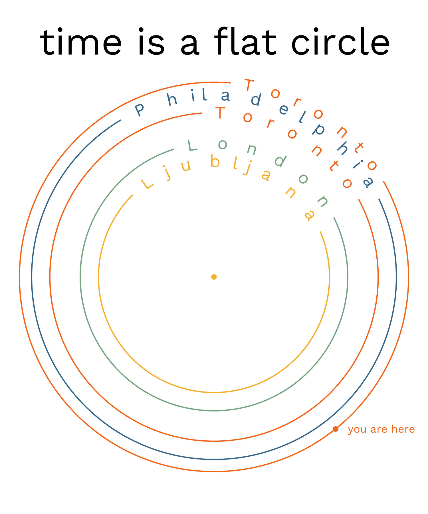

Hi, I'm Iva. I love visualizing data and thinking of new ways to express patterns in noise - and often, it's the noise that's really interesting.  

After my undergrad degree in psychology at UCL, I completed a PhD in cognitive neuroscience at the University of Toronto. I thought _a lot_ about how we find our way from point A to point B in the world, and how we segment the flow of experience in our brains. I then worked as a researcher at UPenn and Temple University, but decided that an academic path wasn't right for me (really, I wasn't right for it). I knew I liked working with data and deep-diving into problems, but craved putting these skills into action with a shorter feedback cycle and concrete real-life applications. I now work in data broadly construed, and I've learned I really enjoy contributing to building things while learning from people across departments.  

The gift my slightly unconventional, potentially chaotic, path in life gave me is that I am always willing to throw myself into projects and map out the problem space on the fly. I'm a strong proponent of a _test-and-learn_ approach. More than anything, I love pushing projects forward together with smart people. 

Here's a (heavily denoised) representation of my life, created in 2024:
